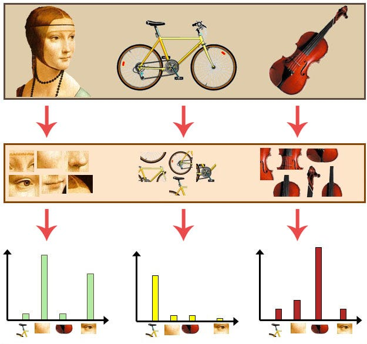

<a name="readme-top"></a>

<!-- PROJECT SHIELDS -->
[![Forks][forks-shield]][forks-url]
[![Stargazers][stars-shield]][stars-url]
[![Issues][issues-shield]][issues-url]
[![MIT License][license-shield]][license-url]
[![LinkedIn][linkedin-shield]][linkedin-url]
[![Gmail][gmail-shield]][gmail-url]

<!-- PROJECT LOGO -->
<br />
<div align="center">
  <a href="https://github.com/marcotallone/bow-classifier">
    
  </a>

<h2 align="center">Bag of Visual Words Classifier</h2>
<h4 align="center">Computer Vision and Pattern Recognition Course Exam Project</h4>
<h4 align="center">SDIC Master Degree, University of Trieste (UniTS)</h4>
<h4 align="center">2024-2025</h4>

  <p align="center">
    Implementing Bag of Visual Words (BoW) classifier<br>for image classification and scene recognition
    <br />
    <br />
    <table>
      <tr>
        <td><a href="./report/main.pdf"><strong>Report</strong></a></td>
        <td><a href="./notebooks/bow-classifier.ipynb"><strong>Python Notebook</strong></a></td>
        <td><a href="./notebooks/bow-classifier.html"><strong>Rendered Notebook</strong></a></td>
      </tr>
    </table>
</div>

<!-- TABLE OF CONTENTS -->
<div align="center">
  <table>
      <tr><td style="text-align: left;">
        <h2>Table of Contents&nbsp;&nbsp;&nbsp;&nbsp;&nbsp;&nbsp;&nbsp;&nbsp;&nbsp;&nbsp;&nbsp;&nbsp;&nbsp;&nbsp;&nbsp;&nbsp;&nbsp;&nbsp;&nbsp;&nbsp;&nbsp;&nbsp;&nbsp;&nbsp;&nbsp;&nbsp;&nbsp;&nbsp;&nbsp;&nbsp;&nbsp;&nbsp;</h2>
        <div style="display: inline-block; text-align: left;" align="left">
          <p>
            &nbsp;1. <a href="#author-info">Author Info</a><br>
            &nbsp;2. <a href="#about-the-project">About The Project</a><br>
              &nbsp;&nbsp;&nbsp;&nbsp;&nbsp;&nbsp;&nbsp;&nbsp;&nbsp;- <a href="#quick-overview">Quick Overview</a><br>
              &nbsp;&nbsp;&nbsp;&nbsp;&nbsp;&nbsp;&nbsp;&nbsp;&nbsp;- <a href="#built-with">Built With</a><br>
              &nbsp;&nbsp;&nbsp;&nbsp;&nbsp;&nbsp;&nbsp;&nbsp;&nbsp;- <a href="#project-structure">Project Structure</a><br>
            &nbsp;3. <a href="#getting-started">Getting Started</a><br>
            &nbsp;4. <a href="#usage-examples">Usage Examples</a><br>
            &nbsp;5. <a href="#contributing">Contributing</a><br>
            &nbsp;6. <a href="#license">License</a><br>
            &nbsp;7. <a href="#references">References</a><br>
            &nbsp;9. <a href="#acknowledgments">Acknowledgments</a><br>
          </p>
        </div>
      </td></tr>
  </table>
</div>

<!-- AUTHOR INFO-->
## Author Info

| Name | Surname | Student ID | UniTS mail | Google mail | Master |
|:---:|:---:|:---:|:---:|:---:|:---:|
| Marco | Tallone | SM3600002 | <marco.tallone@studenti.units.it> | <marcotallone85@gmail.com> | **SDIC** |

<p align="right">(<a href="#readme-top">back to top</a>)</p>

<!-- ABOUT THE PROJECT -->
## About The Project

>[!WARNING] 
>**Generative Tools Notice**:\
> Generative AI tools have been used as a support for the development of this project. In particular, the [Copilot](https://en.wikipedia.org/wiki/Microsoft_Copilot) generative tool based on [OpenAI GPT 4o](https://en.wikipedia.org/wiki/GPT-4) model has been used as assistance medium in performing the following tasks:
> - writing documentation and comments in [implemented functions](./notebooks/utils.py) by adehering to the [NumPy Style Guide](https://numpydoc.readthedocs.io/en/latest/format.html)
> - improving variable naming and code readability
> - minor bug fixing in [implemented functions](./notebooks/utils.py)
> - grammar and spelling check both in this README and in the [report](./report/main.pdf)
> - tweaking aesthetic improvements in [report](./report/main.pdf) plots
> - formatting table of results in [report](./report/main.pdf)

### Quick Overview

The Bag of Visual Words (BoW) model is a popular computer vision technique used for image classification or retrieval. It is based on the idea of treating images as documents and representing them as histograms of visual words belonging to a visual vocabulary, which is obtained by clustering local features extracted from a set of images.

<div style="text-align: center;">
  
</div>

This project implements a BoW image classifier for scene recognition by first building a visual vocabulary from a set of test images and then performing multi-class classification using K-Nearest Neighbors (KNN) and Support Vector Machines (SVM) classifiers.\
In particular, the visual vocabulary is built by clustering SIFT descriptors extracted from the test images and using the K-Means algorithm. Descriptors have been computed both from keypoints detected with the the SIFT algorithm and from dense sampling of the images with a fixed grid to compare the two approaches.\
In the classification phase instead, the performance of a simple KNN classifier is compared with that of different SVM classifiers all adopting the ``*one-vs-all*'' strategy for multi-class classification. The SVM classifiers differ in the kernel used and in the kind of input features they are trained on.\
Additionally, different ways to represent images as input feature vectors are tested. These include the classic representation as normalized histograms of visual words, the implementation of the *soft assignment* techniques proposed by *Van Gemert et al.* [<a href="#ref3">3</a>] and the use of the *spatial pyramid feature representation* proposed by *Lazebnik et al.* [<a href="#ref1">1</a>].\
The objectives of this study are to compare the performance of the different classifiers and image representations and to reproduce the results obtained by *Van Gemert et al.* [<a href="#ref3">3</a>] and *Lazebnik et al.* [<a href="#ref1">1</a>] on the *15-Scenes* dataset.
For further details on the specific feature extraction techniques used and the machine learning algorithms implemented as well as the results with them obtained, please refer to the [official report](./report/main.pdf). For a description of the implementation of the BoW classifier, read instead the [dedicated notebook](./notebooks/bow-classifier.ipynb).

### Project Structure

The project is structured as follows:

```bash
├── 🐍 cv-conda.yaml  # Conda environment
├── 📁 datasets       # Datasets folder
│   ├── test
│   └── train
├── 📁 doc            # Project assignment
├── ⚜️ LICENSE        # License file
├── 📓 notebooks      # Jupyter Notebooks 
│   ├── bow-classifier.ipynb
│   ├── results-plots.ipynb
│   └── utils.py
├── 📜 README.md      # This README file
└── 📁 report         # Report folder
    ├── images
    ├── main.tex
    └── ...
```

In particular the [notebooks/](./notebooks) folder contains the following notebooks:

- [`bow-classifier.ipynb`](./notebooks/bow-classifier.ipynb): the main notebook containing a step-by-step description of the implementation of the BoW classifier
- [`results-plots.ipynb`](./notebooks/results-plots.ipynb): a notebook containing the code to generate the plots and the final results presented in the [report](./report/main.pdf)
- [`utils.py`](./notebooks/utils.py): a Python script containing the utility functions implemented for this project
  
### Built With


<p align="right">(<a href="#readme-top">back to top</a>)</p>

<!-- GETTING STARTED -->
## Getting Started

### Requirements

The project is developed in `Python` and mostly requires the following libraries:

- `numpy`, version `1.26.4`
- [`opencv`](https://opencv.org/), version `4.10.0`
- [`scikit-learn`](https://scikit-learn.org/stable/), version `1.5.2`
- `tqdm`, version `4.67.0`

All the necessary libraries can be easily installed using the `pip` package manager.\
Additionally a [conda environment `yaml` file](./cv-conda.yaml) containing all the necessary libraries for the project is provided in the root folder. To create the environment you need to have installed a working `conda` version and then create the environment with the following command:

```bash
conda env create -f cv-conda.yaml
```

After the environment has been created you can activate it with:

```bash
conda activate cv
```

<!-- USAGE EXAMPLES -->
## Usage Examples

For a detailed step-by-step description of the main tasks performed for this project and the implementation of the BoW classifier, please refer to the [dedicated notebook](./notebooks/bow-classifier.ipynb).

<p align="right">(<a href="#readme-top">back to top</a>)</p>

<!-- CONTRIBUTING -->
## Contributing

The goal of this repository was to implement a classifier based on the Bag of Visual Words approach and reproduce the results presented in the referenced papers in the context of a university exam project. However, if you have a suggestion that would make this better or extend its functionalities and want to share it with me, please fork the repo and create a pull request. You can also simply open an issue with the tag "enhancement" or "extension".\
Suggested contribution procedure:

1. Fork the Project
2. Create your Feature Branch (`git checkout -b feature/AmazingFeature`)
3. Commit your Changes (`git commit -m 'Add some AmazingFeature'`)
4. Push to the Branch (`git push origin feature/AmazingFeature`)
5. Open a Pull Request

<p align="right">(<a href="#readme-top">back to top</a>)</p>

<!-- LICENSE -->
## License

Distributed under the MIT License. See [`LICENSE`](./LICENSE) for more information.

<p align="right">(<a href="#readme-top">back to top</a>)</p>

<!-- REFERENCES -->
## References

<a id="ref1"></a>
[1] S. Lazebnik, C. Schmid, J. Ponce, *"Beyond Bags of Features: Spatial Pyramid Matching for Recognizing Natural Scene Categories"*, 2006 IEEE Computer Society Conference on Computer Vision and Pattern Recognition (CVPR'06), Volume 2, 2006, Pages 2169-2178, [https://doi.org/10.1109/CVPR.2006.68](https://ieeexplore.ieee.org/document/1641019)

<a id="ref2"></a>
[2] L. Fei-Fei, P. Perona, *"A Bayesian hierarchical model for learning natural scene categories"*, 2005 IEEE Computer Society Conference on Computer Vision and Pattern Recognition (CVPR'05), Volume 2, 2005, Pages 524-531 vol. 2, [https://doi.org/10.1109/CVPR.2005.16](https://ieeexplore.ieee.org/document/1467326)

<a id="ref3"></a>
[3] J.C. van Gemert, J.-M. Geusebroek, C.J. Veenman, A.W.M. Smeulders, *"Kernel Codebooks for Scene Categorization"*, Computer Vision -- ECCV 2008, 2008, Springer Berlin Heidelberg, Pages 696-709, [https://doi.org/10.1007/978-3-540-88693-8_52](https://link.springer.com/chapter/10.1007/978-3-540-88693-8_52)

<a id="ref4"></a>
[4] C.-C. Chang, C.-J. Lin, *"LIBSVM: A library for support vector machines"*, ACM Transactions on Intelligent Systems and Technology (TIST), Volume 2, Number 3, 2011, Pages 1-27, [https://doi.org/10.1145/1961189.1961199](https://dl.acm.org/doi/10.1145/1961189.1961199)

<a id="ref5"></a>
[5] P. J. Rousseeuw, *"Silhouettes: A graphical aid to the interpretation and validation of cluster analysis"*, Journal of Computational and Applied Mathematics, Volume 20, 1987, Pages 53-65, [https://doi.org/10.1016/0377-0427(87)90125-7](https://www.sciencedirect.com/science/article/pii/0377042787901257)

<a id="ref6"></a>
[6] F. Pedregosa, G. Varoquaux, A. Gramfort, V. Michel, B. Thirion, O. Grisel, M. Blondel, P. Prettenhofer, R. Weiss, V. Dubourg, J. Vanderplas, A. Passos, D. Cournapeau, M. Brucher, M. Perrot, E. Duchesnay, *"Scikit-learn: Machine learning in Python"*, Journal of Machine Learning Research, Volume 12, 2011, Pages 2825-2830, [https://www.jmlr.org/papers/volume12/pedregosa11a/pedregosa11a.pdf](https://www.jmlr.org/papers/volume12/pedregosa11a/pedregosa11a.pdf)

<p align="right">(<a href="#readme-top">back to top</a>)</p>

<!-- ACKNOWLEDGMENTS -->
## Acknowledgments

- [Computer Vision and Pattern Recognition course material (UniTS, Fall 2024)](https://moodle2.units.it/enrol/index.php?id=14024) (*access restricted to UniTS students and staff*)
- [Best-README-Template](https://github.com/othneildrew/Best-README-Template?tab=readme-ov-file): for the README template
- [Flaticon](https://www.flaticon.com/free-icon/shopping-bag_2413526?related_id=2413552&origin=search): for the icons used in the README

<p align="right">(<a href="#readme-top">back to top</a>)</p>

<!-- MARKDOWN LINKS & IMAGES -->
<!-- https://www.markdownguide.org/basic-syntax/#reference-style-links -->
[forks-shield]: https://img.shields.io/github/forks/marcotallone/bow-classifier.svg?style=for-the-badge
[forks-url]: https://github.com/marcotallone/bow-classifier/network/members
[stars-shield]: https://img.shields.io/github/stars/marcotallone/bow-classifier.svg?style=for-the-badge
[stars-url]: https://github.com/marcotallone/bow-classifier/stargazers
[issues-shield]: https://img.shields.io/github/issues/marcotallone/bow-classifier.svg?style=for-the-badge
[issues-url]: https://github.com/marcotallone/bow-classifier/issues
[license-shield]: https://img.shields.io/github/license/marcotallone/bow-classifier.svg?style=for-the-badge
[license-url]: https://github.com/marcotallone/bow-classifier/blob/master/LICENSE
[linkedin-shield]: https://img.shields.io/badge/-LinkedIn-blue?style=for-the-badge&logo=linkedin&logoColor=white&colorB=0077B5
[linkedin-url]: https://linkedin.com/in/marco-tallone-40312425b
[gmail-shield]: https://img.shields.io/badge/-Gmail-red?style=for-the-badge&logo=gmail&logoColor=white&colorB=red
[gmail-url]: mailto:marcotallone85@gmail.com
